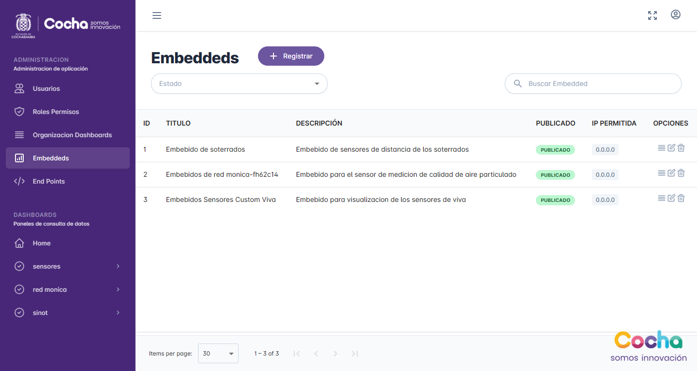

# ✨ Nuestras Funcionalidades

<figure><figcaption>
Opciones para usuario administrador
</figcaption></figure>

 

<figure><figcaption>
Opciones para usuario registrado(sujeto a permisos asignado por administrador)
</figcaption></figure>

El usuario **administrador** podra acceder a todas las funcionalidades tanto de administración como de vista de todos los dashboards.

El usuario **regular** solo podrá acceder al apartador de "Dashboards" y a las vistas q se le seran asignadas desde el lado de administración.


**GitBook tip:** A succinct video overview is a great way to introduce folks to your product. Embed a Loom, Vimeo or YouTube video and you're good to go! We love this video from the fine folks at Loom as a perfect example of a succinct feature overview.


## Usuarios


Apartado disponible solo para usuario con rol **Administrador.**


Este apartado permite la administración de usuarios que acceden a la aplicación.  Las funcionalidades disponibles son el listado a través de una tabla de datos, creación y edición de usuarios a través de un formulario y la eliminación con alerta de confirmación.

La tabla de listado de usuarios cuenta con paginación al pie de la pagina y con filtros por rol, estado y búsqueda de manera general, como se muestra en la imagen inferior.

<figure><figcaption>
Tabla de datos de usuarios con paginación y funcionalidad de filtros.  
</figcaption></figure>

El registro y edición de usuarios se realiza a través de un formulario donde se llenan los datos de usuario, con las opciones de habilitado y asignación de rol en la aplicación. La opción de edición se encuentra en la columna de opcion en linea con el registro a editar

<figure><figcaption>
Registro y edición de usuarios
</figcaption></figure>

La opción de eliminar usuario se encuentra en línea con el registro en la columna de opciones, antes de eliminar el registro mostrara una alerta de confirmación.

<figure><figcaption></figcaption></figure>

## Roles y Permisos


Apartado disponible solo para usuario con rol **Administrador.**


La administración de acceso a los diferentes dashboards se realiza a través de permisos que representan a un dashboard y estos van agrupados en roles q podrán ser asignados a los usuarios.

En la vista inicial se muestra todos los roles en la aplicación  con forma de tarjetas con el detalle de su nombre, cantidad de usuarios con el rol, las opciones de edición y eliminado y botón de registro de nuevos roles.&#x20;

<figure><figcaption>
Vista de roles en aplicación.
</figcaption></figure>

El registro de un nuevo rol se realiza a través de un formulario donde se asigna el nombre y los dashboards a los cuales se otorgara acceso mediante el rol.

<figure><figcaption>
Registrar nuevo Rol.
</figcaption></figure>

Se puede acceder a la opción de edición de rol a través del botón bajo el nombre de cada rol, este desplegara un formulario con los datos del rol que se pueden editar.

<figure><figcaption>
Edición de datos de Rol.
</figcaption></figure>

La opción de eliminado de rol se encuentra en la parte inferior izquierda de cada tarjeta de rol, este desplegara una alerta de confirmación para realizar la acción.

<figure><figcaption>
Eliminado de Rol.
</figcaption></figure>

## Organizacion Dashboards


Apartado disponible solo para usuario con rol **Administrador.**


Esta apartado administra la organización que se muestra en la sección de "Dashboards", los dashboards se organizan en grupos.

La vista inicial muestra una tabla con detalle de dashboards asociados al grupo, con una columna de opciones por registro con las funcionalidades de registro, edición y eliminado de grupo y dashboard, además de una función extra de endpoints por registro de dashboard que se vera mas adelante.

<figure><figcaption>
Lista de grupos y dashboards.
</figcaption></figure>

El registro de grupos se encuentra a lado del titulo principal, el registro de dashboards se realiza en la columna de opciones de cada fila de registro de grupo, ambos despliegan un formulario con los datos necesarios para el tipo de registro.

<figure><figcaption>
Registro de Grupo y Dashboard
</figcaption></figure>

La edición de información de grupo y dashboards se encuentra en la columna de opciones, este despliega un formulario donde se podrá actualizar la información deseada.

<figure><figcaption>
Edición de grupo y dashboard.
</figcaption></figure>

La función de eliminado de grupos y dashboards se encuentra en la columna de opciones del respectivo registro, este despliega una alerta de confirmación antes de realizar la acción.&#x20;

<figure><figcaption>
Eliminar Grupo o Dashboard.
</figcaption></figure>

### Endpoints

Los endpoints son registros asociados al "dashboard" que manejan las consultas de datos necesarias para los gráficos e indicadores en las vistas. Estos tienes su propio apartado de administración con las funcionalidades de creación, edición y eliminado.

<figure><figcaption>
Panel de endpoints, consultas de datos q utiliza cada dashboard.
</figcaption></figure>


Solo se pueden registrar consultas de tipo sql "SELECT"


El panel muestra un formulario q permite registrar nuevas consultas de datos, además de un listado con una columna de opciones al final con  las acciones de editar y eliminar.&#x20;

## Embeddeds


Apartado disponible solo para usuario con rol **Administrador.**


Registros de paginas diseñadas especialmente para ser embebidas en sitios externos.&#x20;

La vista inicial consta de un listado con una columna de opciones donde se puede agregar consultas al registro como en la sección [#endpoints](./#endpoints "mention"), editar información y eliminar.

<figure><figcaption>
Listado de embeddeds
</figcaption></figure>

<figure><figcaption>
Registrar, editar embeddeds.
</figcaption></figure>

## End Points


Apartado disponible solo para usuario con rol **Administrador.**


Este apartado muestra una lista general de todos los registros de consulta creados tanto para paginas dashboard como paginas embebidas.

<figure><figcaption>
Vista general de endpoint creados para las diferentes paginas.
</figcaption></figure>

## Home

La pagina "Home" es la pagina inicial al ingresar a la aplicación, dependiendo el rol del usuario se puede visualizar o todos los dashboard de datos creados o los asignados segun el administrador.

<figure><figcaption>
Vista home con vista general de dashboards creados.
</figcaption></figure>

Las tarjetas de dashboards redirigen a la vista de dashboard deseada que de igual manera se puede acceder en el menu de navegacion sección de "dashboards".
